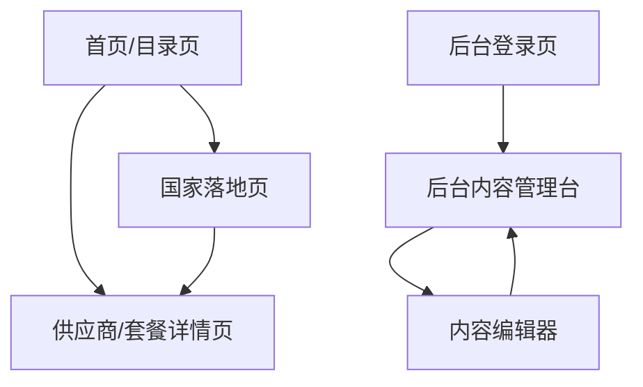

## 1. Product Overview
面向全球用户的 eSIM 目录网站，聚合各国家/地区的 eSIM 供应商与套餐信息，帮助用户快速筛选、对比并跳转购买。
面向运营团队提供后台内容发布与审核流程，持续产出可被搜索引擎收录的国家页与供应商页。

## 2. Core Features

### 2.1 User Roles
| 角色 | 注册/登录方式 | 核心权限 |
|------|--------------|----------|
| 访客用户 | 无需登录 | 浏览国家页/供应商页；搜索与筛选；跳转外部购买链接 |
| 后台编辑/管理员 | Supabase Auth（邮箱+密码或Magic Link） | 登录后台；新增/编辑/发布供应商、套餐、国家SEO页；上传图片；设置重定向；查看发布状态 |

### 2.2 Feature Module
我们的 eSIM 目录需求由以下页面组成：
1. **首页/目录页**：国家入口、搜索与筛选、结果列表、基础信任信息（更新时间/数据来源声明）。
2. **国家落地页（SEO）**：国家介绍、推荐供应商与套餐列表、面向SEO的结构化内容区。
3. **供应商/套餐详情页（SEO）**：供应商信息、套餐规格与价格、覆盖国家、CTA跳转购买。
4. **后台登录页**：鉴权登录、权限校验、退出登录。
5. **后台内容管理台**：内容列表与编辑器、发布/下线、媒体管理、SEO字段与预览、基础审计记录。

### 2.3 Page Details
| Page Name | Module Name | Feature description |
|-----------|-------------|---------------------|
| 首页/目录页 | 国家入口 | 展示热门国家与大洲分组；进入国家落地页 |
| 首页/目录页 | 搜索与筛选 | 按国家/供应商名搜索；筛选（流量档、天数、是否支持热点、价格区间、网络制式如4G/5G/本地号码可选） |
| 首页/目录页 | 结果列表 | 展示卡片（供应商、最低价起、典型套餐、评分/标签、最后更新）；进入详情页 |
| 首页/目录页 | SEO基础 | 输出可索引的静态文案区；规范化 canonical；站点地图入口（由系统生成） |
| 国家落地页 | 国家内容区 | 展示国家简介、适用人群、常见问题（可由编辑维护） |
| 国家落地页 | 推荐与列表 | 展示推荐供应商与套餐列表；支持同页筛选排序（价格/热度/更新时间） |
| 国家落地页 | SEO增强 | 输出可复用的结构化内容块（H2/H3）；支持面包屑；提供可选FAQ Schema字段 |
| 供应商/套餐详情页 | 详情信息 | 展示供应商介绍、支持国家、网络与eKYC要求、支持方式（App/邮件/在线） |
| 供应商/套餐详情页 | 套餐规格 | 展示流量/天数/是否无限/热点/5G/价格/币种/退款规则；对外购买链接（带UTM） |
| 供应商/套餐详情页 | 合规与信任 | 展示免责声明、价格更新时间、数据来源；避免误导性“保证最低价” |
| 后台登录页 | 登录与会话 | 支持登录/退出；错误提示；成功后跳转后台管理台 |
| 后台内容管理台 | 内容列表 | 供应商/套餐/国家页列表；草稿/已发布/已下线状态；搜索与排序 |
| 后台内容管理台 | 内容编辑器 | 新增/编辑字段（名称、slug、国家覆盖、套餐、价格、外链、标签、SEO标题/描述、FAQ、canonical、noindex） |
| 后台内容管理台 | 发布流程 | 草稿→提交发布→发布/下线；发布前校验（必填、slug唯一、外链合法、图片存在） |
| 后台内容管理台 | 媒体管理 | 上传Logo/头图；自动生成多尺寸；可替换与删除 |
| 后台内容管理台 | 审计与回滚 | 记录编辑人/时间/变更摘要；支持将单条内容回滚到上一个已发布版本 |

## 3. Core Process
### 3.1 访客浏览与转化流程
1) 从搜索引擎或首页进入国家落地页/供应商详情页 → 2) 使用筛选找到合适套餐 → 3) 进入详情页核对规格与限制 → 4) 点击“去购买”跳转到外部供应商页面（附UTM）

### 3.2 后台内容发布流程（编辑/管理员）
1) 登录后台 → 2) 新建或编辑供应商/套餐/国家页草稿 → 3) 填写SEO字段并预览 → 4) 提交发布校验（slug唯一、必填、外链/图片） → 5) 发布上线（前台可访问、进入站点地图）或下线（前台返回404/410策略） → 6) 如需修正，基于已发布版本再编辑并再次发布；必要时回滚

### 3.3 页面导航流程图

