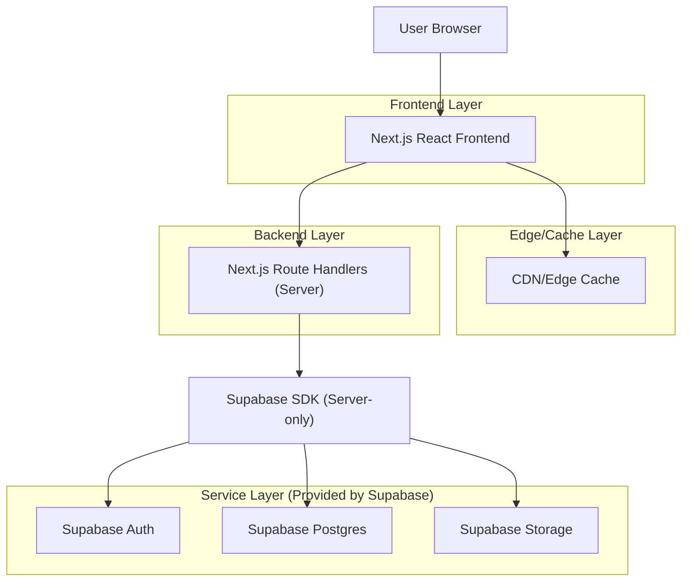
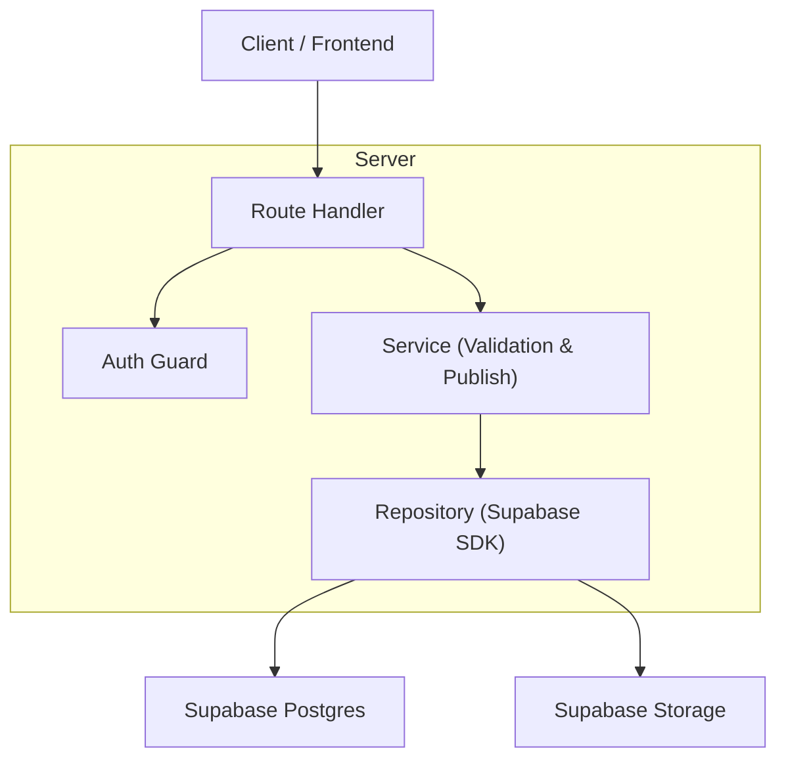
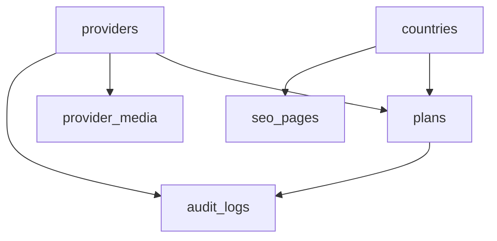

## 1.Architecture design


## 2.Technology Description
- Frontend: Next.js (React@18) + TypeScript + Tailwind CSS
- Backend: Next.js Route Handlers/Server Actions（用于鉴权会话、内容写入、公开读接口聚合）
- Database/Auth/Storage: Supabase（PostgreSQL + Auth + Storage）

## 3.Route definitions
| Route | Purpose |
|-------|---------|
| / | 首页/目录页（搜索、筛选、列表） |
| /country/[slug] | 国家落地页（SEO内容+推荐列表） |
| /provider/[slug] | 供应商/套餐详情页（SEO详情+购买跳转） |
| /admin/login | 后台登录 |
| /admin | 后台内容管理台（概览） |
| /admin/providers | 供应商管理（列表/编辑/发布） |
| /admin/plans | 套餐管理（列表/编辑/发布） |
| /admin/countries | 国家与SEO页管理 |
| /sitemap.xml | 站点地图（仅收录已发布页面） |
| /robots.txt | 抓取策略（可对草稿/后台禁止抓取） |

## 4.API definitions (If it includes backend services)
### 4.1 Shared Types (TypeScript)
```ts
export type PublishStatus = 'draft' | 'published' | 'archived'

export type Country = {
  id: string
  name: string
  iso2: string
  slug: string
  hero_image_path?: string
  seo_title?: string
  seo_description?: string
  faq_json?: unknown
  status: PublishStatus
  updated_at: string
}

export type Provider = {
  id: string
  name: string
  slug: string
  website_url: string
  logo_path?: string
  support_channels?: string[]
  status: PublishStatus
  updated_at: string
}

export type Plan = {
  id: string
  provider_id: string
  country_iso2: string
  data_gb?: number
  days: number
  is_unlimited: boolean
  supports_hotspot: boolean
  network_type?: '4G' | '5G' | 'LTE/5G'
  price_amount: number
  price_currency: string
  purchase_url: string
  status: PublishStatus
  updated_at: string
}
```

### 4.2 Core API (examples)
公开读（用于SSR/ISR渲染，避免前端直连Supabase）：
- `GET /api/public/search?country=jp&query=airalo&minDays=7`
- `GET /api/public/country/:slug`
- `GET /api/public/provider/:slug`

后台写（需要登录会话 + 角色校验）：
- `POST /api/admin/providers` / `PUT /api/admin/providers/:id`
- `POST /api/admin/plans` / `PUT /api/admin/plans/:id`
- `POST /api/admin/publish`（提交发布/下线，统一校验入口）

## 5.Server architecture diagram (If it includes backend services)


## 6.Data model(if applicable)
### 6.1 Data model definition


### 6.2 Data Definition Language
```sql
-- countries
CREATE TABLE countries (
  id UUID PRIMARY KEY DEFAULT gen_random_uuid(),
  name TEXT NOT NULL,
  iso2 CHAR(2) NOT NULL,
  slug TEXT UNIQUE NOT NULL,
  hero_image_path TEXT,
  seo_title TEXT,
  seo_description TEXT,
  faq_json JSONB,
  status TEXT NOT NULL DEFAULT 'draft',
  updated_at TIMESTAMPTZ NOT NULL DEFAULT now(),
  created_at TIMESTAMPTZ NOT NULL DEFAULT now()
);
CREATE INDEX idx_countries_iso2 ON countries(iso2);
CREATE INDEX idx_countries_status_updated ON countries(status, updated_at DESC);

-- providers
CREATE TABLE providers (
  id UUID PRIMARY KEY DEFAULT gen_random_uuid(),
  name TEXT NOT NULL,
  slug TEXT UNIQUE NOT NULL,
  website_url TEXT NOT NULL,
  logo_path TEXT,
  support_channels TEXT[],
  status TEXT NOT NULL DEFAULT 'draft',
  updated_at TIMESTAMPTZ NOT NULL DEFAULT now(),
  created_at TIMESTAMPTZ NOT NULL DEFAULT now()
);
CREATE INDEX idx_providers_status_updated ON providers(status, updated_at DESC);

-- plans (logical foreign keys: provider_id + country_iso2)
CREATE TABLE plans (
  id UUID PRIMARY KEY DEFAULT gen_random_uuid(),
  provider_id UUID NOT NULL,
  country_iso2 CHAR(2) NOT NULL,
  data_gb NUMERIC,
  days INT NOT NULL,
  is_unlimited BOOLEAN NOT NULL DEFAULT false,
  supports_hotspot BOOLEAN NOT NULL DEFAULT true,
  network_type TEXT,
  price_amount NUMERIC NOT NULL,
  price_currency CHAR(3) NOT NULL,
  purchase_url TEXT NOT NULL,
  status TEXT NOT NULL DEFAULT 'draft',
  updated_at TIMESTAMPTZ NOT NULL DEFAULT now(),
  created_at TIMESTAMPTZ NOT NULL DEFAULT now()
);
CREATE INDEX idx_plans_country_status_price ON plans(country_iso2, status, price_amount);
CREATE INDEX idx_plans_provider_id ON plans(provider_id);

-- seo_pages (for country/provider custom landing sections)
CREATE TABLE seo_pages (
  id UUID PRIMARY KEY DEFAULT gen_random_uuid(),
  page_type TEXT NOT NULL, -- 'country' | 'provider'
  ref_slug TEXT NOT NULL,
  content_md TEXT NOT NULL,
  canonical_url TEXT,
  noindex BOOLEAN NOT NULL DEFAULT false,
  status TEXT NOT NULL DEFAULT 'draft',
  updated_at TIMESTAMPTZ NOT NULL DEFAULT now(),
  created_at TIMESTAMPTZ NOT NULL DEFAULT now()
);
CREATE INDEX idx_seo_pages_type_slug ON seo_pages(page_type, ref_slug);

-- audit_logs
CREATE TABLE audit_logs (
  id UUID PRIMARY KEY DEFAULT gen_random_uuid(),
  actor_user_id UUID,
  entity_type TEXT NOT NULL,
  entity_id UUID,
  action TEXT NOT NULL, -- 'create'|'update'|'publish'|'archive'|'rollback'
  diff_json JSONB,
  created_at TIMESTAMPTZ NOT NULL DEFAULT now()
);
CREATE INDEX idx_audit_logs_entity_created ON audit_logs(entity_type, entity_id, created_at DESC);

-- grants (public read for published content)
GRANT SELECT ON countries TO anon;
GRANT SELECT ON providers TO anon;
GRANT SELECT ON plans TO anon;
GRANT SELECT ON seo_pages TO anon;

GRANT ALL PRIVILEGES ON countries TO authenticated;
GRANT ALL PRIVILEGES ON providers TO authenticated;
GRANT ALL PRIVILEGES ON plans TO authenticated;
GRANT ALL PRIVILEGES ON seo_pages TO authenticated;
GRANT ALL PRIVILEGES ON audit_logs TO authenticated;
```

## SEO / 性能目标（实现导向）
- SEO：国家页与供应商页可被索引（SSR/ISR输出完整HTML）；提供 `sitemap.xml`、`robots.txt`、规范化 canonical；面包屑与清晰信息架构。
- 性能：LCP ≤ 2.5s、INP ≤ 200ms、CLS ≤ 0.1（以真实用户监控为准）；首页列表首屏≤1次API请求；图片使用响应式尺寸与懒加载。

## 缓存策略（无额外中间件）
- Edge/CDN：国家页/供应商页使用 ISR（按内容更新时间触发再生成）+ `Cache-Control: s-maxage, stale-while-revalidate`。
- 应用层：公开读API对相同查询参数启用短TTL缓存（例如30-120s），后台发布时触发按tag/slug失效。
- 数据库层：为搜索/筛选关键字段建立组合索引；只查询 `status='published'` 的公开数据。

## 鉴权与权限
- 后台登录：Supabase Auth，Next.js 服务端保存会话cookie；所有 `/admin/*` 与写API统一做角色校验。
- 内容访问：公开页面仅读取已发布数据；草稿仅后台可见。
